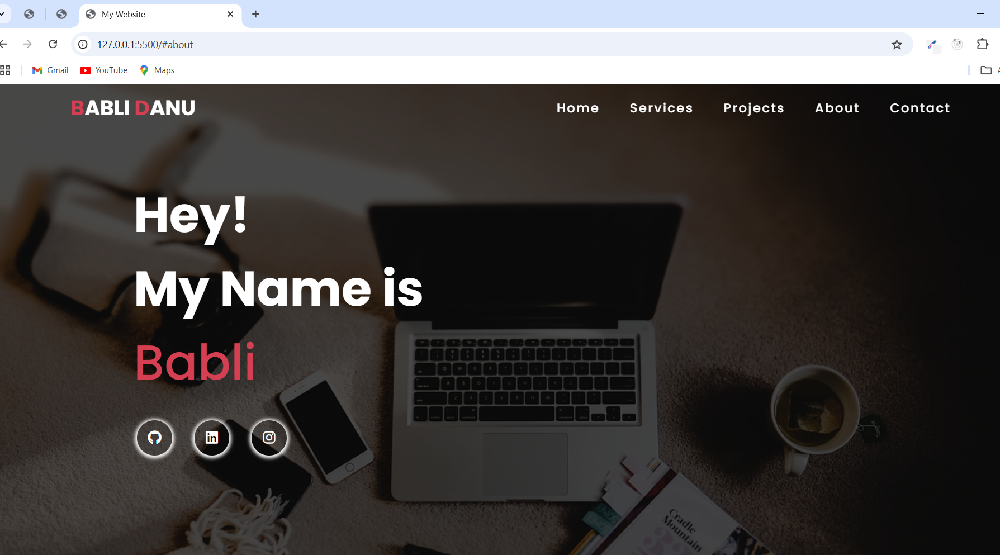
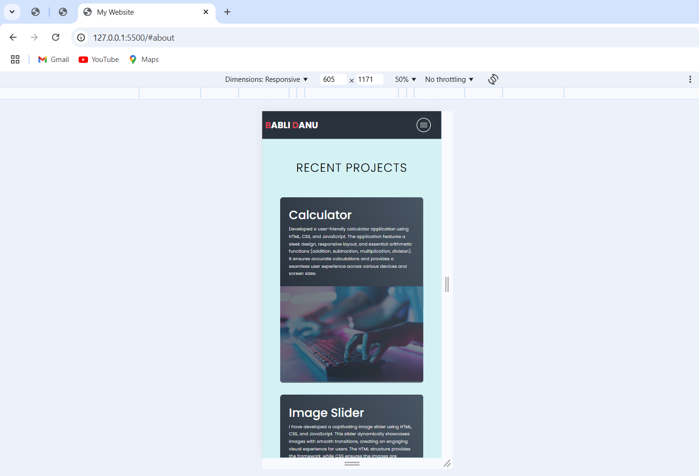

# Personal Portfolio

---

Welcome to my personal portfolio website! This project showcases my skills, projects, and contact information as a Frontend Developer. The website is designed to provide a comprehensive overview of my work and professional background.

## Features

---

- **Responsive Design**: The website is fully responsive and adapts to various screen sizes.
- **Smooth Navigation**: Easy navigation through sections such as Home, Services, Projects, About, and Contact.
- **Social Media Links**: Links to my GitHub, LinkedIn, and Instagram profiles.
- **Project Showcase**: A section dedicated to showcasing my recent projects with descriptions.

## Technologies Used

---

- HTML
- CSS
- JavaScript
- Font Awesome (for icons)
- Responsive design techniques

## Getting Started

---

1. Clone the repository.
2. Open the `index.html` file in a browser to run the project.

## Website Looks Like

---

